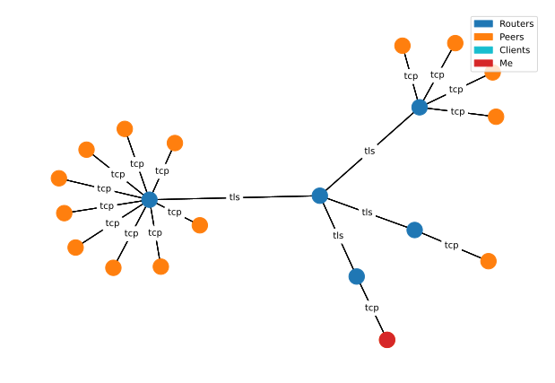

# zenoh-cli
A command line tool for interacting with a Zenoh session

Typical use cases include:
* Tests
* Investigations
* Probing
* As part of a bash pipeline

`zenoh-cli` makes use of `codecs` for encoding and decoding to and from the wire payloads on the zenoh network bus. By default, `zenoh-cli` bundles the following codecs:

* text
* base64
* JSON

A plugin system is in place to allow for easily extending the available codecs in `zenoh-cli`, see below.

## Installation
`pip install zenoh-cli`

## Usage
```cmd
usage: zenoh [-h] [--mode {peer,client}] [--connect CONNECT] [--listen LISTEN] [--config CONFIG] [--log-level LOG_LEVEL] {info,network,scout,delete,put,subscribe,get} ...

Zenoh command-line client application

positional arguments:
  {info,network,scout,delete,put,subscribe,get}

options:
  -h, --help            show this help message and exit
  --mode {peer,client}
  --connect CONNECT     Endpoints to connect to. (default: None)
  --listen LISTEN       Endpoints to listen on. (default: None)
  --config CONFIG       A path to a configuration file. (default: None)
  --log-level LOG_LEVEL
```

## Example output of `zenoh network`



## Extending with codecs for encoding/decoding values

`zenoh-cli` comes with a plugin system for easily extending it with custom encoders and decoders (codecs) for the data values. The plugin system makes use of the entrypoints provided by setuptools, see [here](https://setuptools.pypa.io/en/latest/userguide/entry_point.html) for details. `zenoh-cli` gather plugins from two custom "groups":

* `zenoh-cli.codecs.encoders`
* `zenoh-cli.codecs.decoders`

For an example, see [example_plugin](./example_plugin/)
